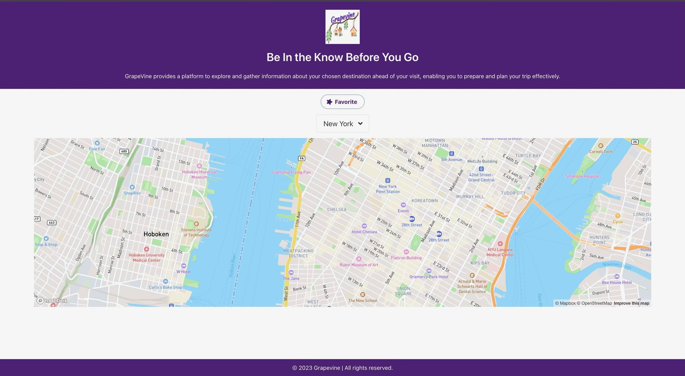
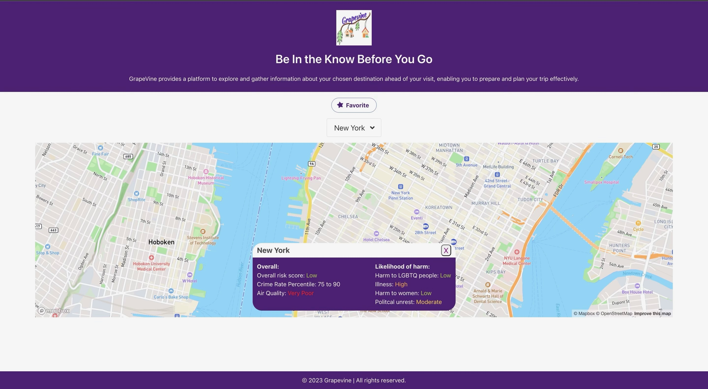

# Grapevine

## Description

Grapevine is a cutting-edge application designed to transform the way you explore global cities. Our mission is to provide users with comprehensive safety information about their chosen travel destination before they arrive, allowing them to plan their trips effectively and efficiently.

Leveraging multiple APIs, Grapevine provides an extensive overview of chosen destinations. Our proprietary city information API is supplemented with data from various sources: OpenWeatherMap furnishes us with air quality details, crime rates are obtained from Precisely, and Amadeus provides safety scores. This diverse collection of details gives you a holistic picture of your chosen destination, including overall city ratings and safety statistics ensuring you're in the know before you go.

For an enriched user experience, we incorporate Mapbox for dynamic, interactive maps, offering you a visual tour of your selected destination. Further, we use the Bulma CSS Framework and Mapbox GL JS for map generation, creating a clean, modern interface that makes city exploration an enjoyable experience.

### Main Features:

1. Search: When a user selects a city from the dropdown menu, the system fetches data about that location.
2. City Information Display: The fetched data is displayed, providing the user with comprehensive information about their selected city. This could include details like overall city ratings, safety stats, climate, and more.
3. Interactive Map: An interactive Mapbox map is displayed based on the selected city, giving the user a visual perspective of the location.
4. Favorites: The 'Favorites' feature allows users to bookmark their preferred locations, storing this data in local storage for quick future reference, further enhancing usability and personalization.

Please note, while Grapevine covers a range of destinations, the usage of certain APIs is currently limited. For example, Amadeus provides safety scores for only the eight referenced cities, and crime rate data from Precisely is available exclusively for USA cities.

Though our main feature currently involves providing extensive city information, Grapevine's functionality and coverage have a vast potential for expansion. Keep an eye out for updates as we continue to grow and enhance our offerings!

### APIs Utilized:

1. Mapbox API - Interactive map generation
2. OpenWeatherMap API - Air quality information
3. Precisely API - Crime rate data
4. Amadeus API - Safety scores

### CSS Framework:

Bulma

## Screenshots

## Link to the Deployed Application

Link to Deployed Application: https://lucygouvin.github.io/grapevine/